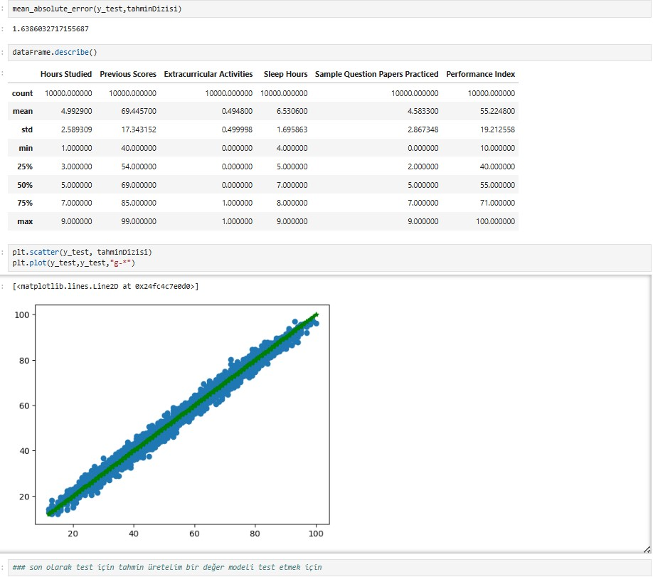
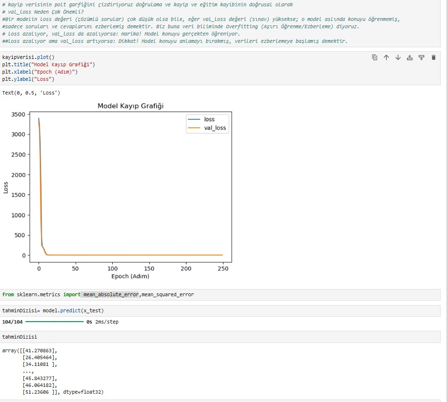
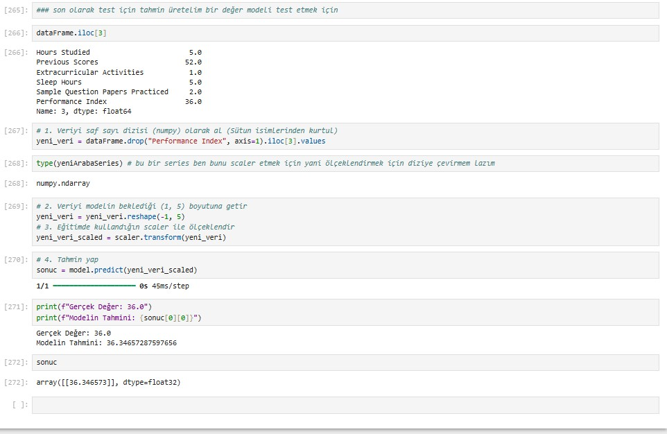

# StudentPerformanceRegresyon
Using the available data, you are asked to estimate a student's "Performance Index" (a number between 10 and 100) based on their habits and history.
## Images

### screenshot

  

  

  

