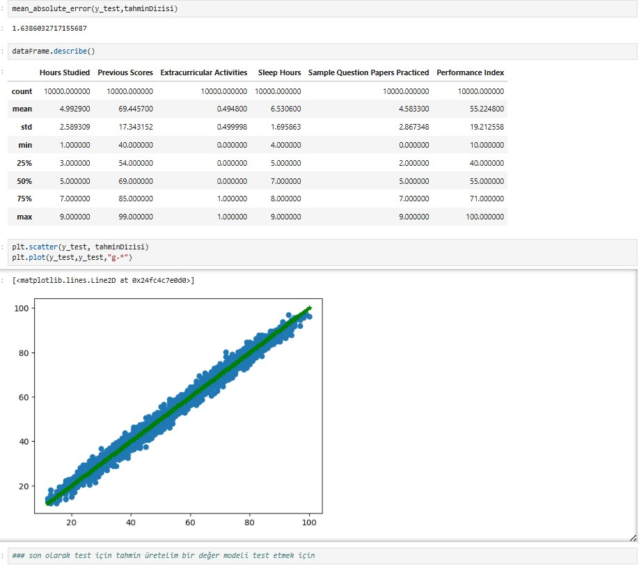
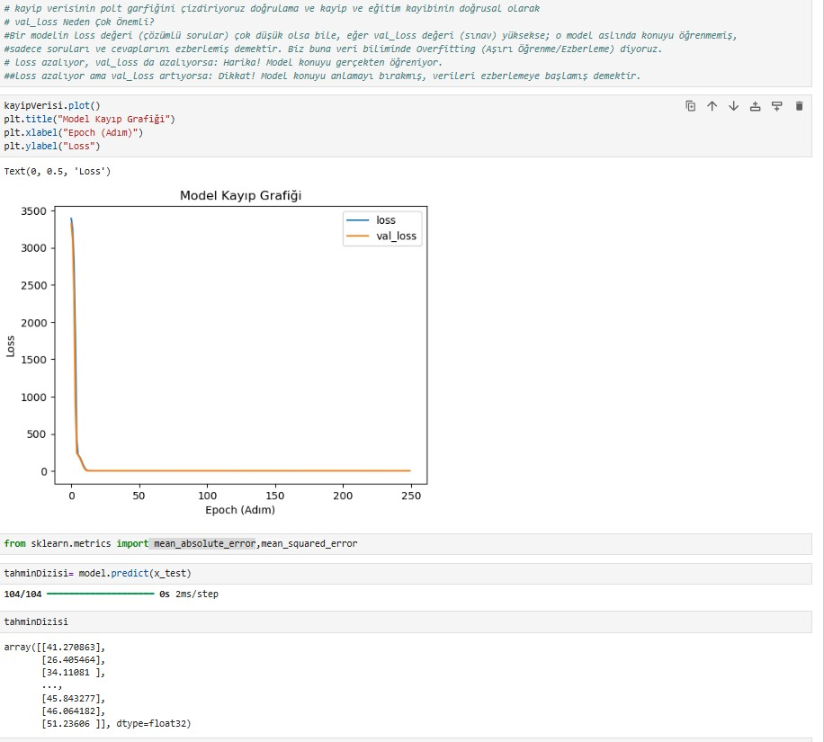
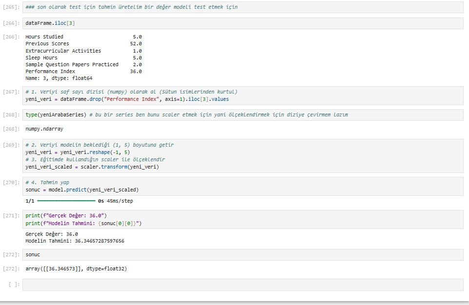

# 🎓 AI-Powered Student Performance Predictor
Using the available data, you are asked to estimate a student's "Performance Index" (a number between 10 and 100) based on their habits and history.
This project is a fullstack machine learning application that predicts a student's **Performance Index (10–100)** based on their study habits and academic history.

---

## 🚀 Features

- 📊 Predict student performance using AI
- ⚡ Real-time prediction via FastAPI
- 🎨 Modern UI with React
- 🔄 Scaled data using MinMaxScaler
- 🧠 Trained Neural Network (TensorFlow/Keras)

---

## 🛠️ Tech Stack

### Frontend
- React (TypeScript)
- React Bootstrap

### Backend
- FastAPI
- Python

### Machine Learning
- TensorFlow / Keras
- Scikit-learn (MinMaxScaler)

---

## 📥 Input Features

The model takes the following inputs:

- Hours Studied
- Previous Scores
- Extracurricular Activities (Yes/No)
- Sleep Hours
- Sample Papers Practiced

---

## 📤 Output

- Predicted **Performance Index (10–100)**

---

## ⚙️ How It Works

1. User enters data in the React UI
2. Data is sent to FastAPI backend
3. Backend scales input using MinMaxScaler
4. Model predicts performance
5. Result is returned and displayed

---

## 🧠 Model Training

The model was trained using TensorFlow and optimized with normalized input data for better accuracy.

---

## 📚 Learning Source

This project was developed as part of my learning journey through:

- 🇹🇷 BTK Akademi
  - Veri Bilimine Giriş
  - Veri Bilimi için Python ve TensorFlow

---

## 📌 Future Improvements

- 📈 Add charts for visualization
- 🔍 Input validation
- ⏳ Loading animations
- ☁️ Deployment (Vercel + Render)

---

## 🤝 Contributing

Feel free to fork, improve, and contribute!

---

## 📧 Contact

If you have any feedback, feel free to reach out!

---

⭐ Don't forget to star this repo if you like it!
## Images

### screenshot

  

  

  

